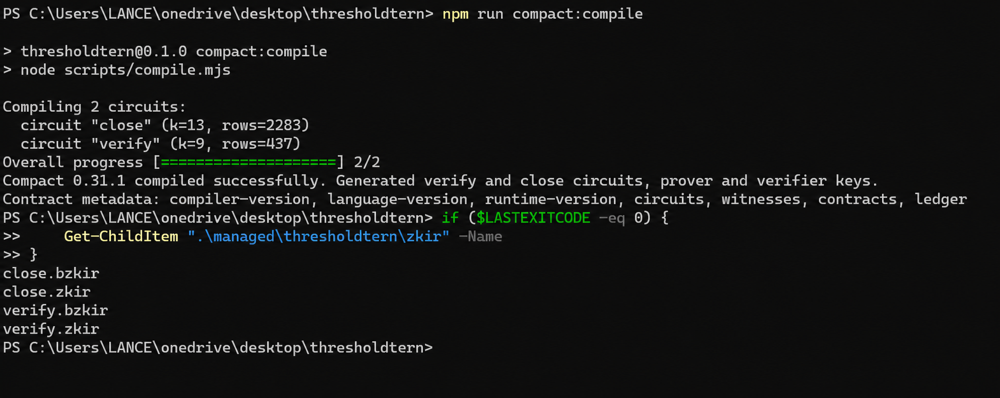
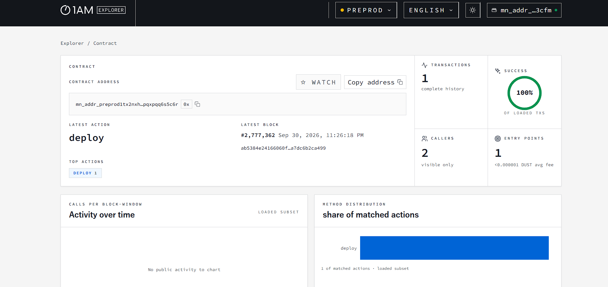
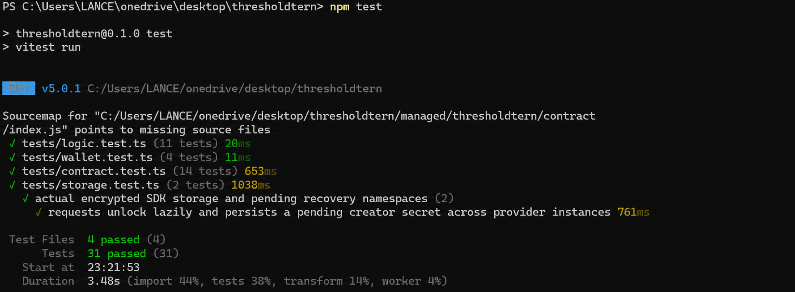

# ThresholdTern

> Prove eligibility without revealing the underlying value.

[](https://github.com/lancegraganza/thresholdtern/actions/workflows/ci.yml)

**Midnight Level 1–3 submission · Age / Eligibility Gate · Preprod**

ThresholdTern lets an organizer publish an eligibility threshold and a participant prove that a private number meets it. Midnight verifies the proof and records the result without publishing the exact value. The current version demonstrates **self-asserted age and numeric thresholds**; trusted issuer credentials are the next step toward authenticated age assurance.

## Submission links

| Resource | Link |
| --- | --- |
| Live website | [thresholdtern.vercel.app](https://thresholdtern.vercel.app/) |
| Demo video | [Watch the demo](https://drive.google.com/file/d/1wIQzhaT02_1Jx08aVCcaBP4vzKJGpZWs/view?usp=sharing) |
| Public repository | [lancegraganza/thresholdtern](https://github.com/lancegraganza/thresholdtern) |
| Participant flow | [Open the submitted gate](https://thresholdtern.vercel.app/verify/5995335dd78d171d91a826f4cd0ba943be448869409764904b404f34f0203040) |
| Contract source | [thresholdtern.compact](contracts/thresholdtern.compact) |
| CI/CD | [Workflow](.github/workflows/ci.yml) · [Actions runs](https://github.com/lancegraganza/thresholdtern/actions/workflows/ci.yml) |
| Commit history | [View development milestones](https://github.com/lancegraganza/thresholdtern/commits/main/) |

## Deployed contract

**Network:** Midnight Preprod  
**Submitted contract address:**

```text
5995335dd78d171d91a826f4cd0ba943be448869409764904b404f34f0203040
```

Each published gate has its own contract address and participant URL. See the [deployment screenshot](public/deployedcontract.png) for the submitted deployment evidence.

To check public state and compare the deployed circuit verifier keys with the generated contract artifacts:

```sh
npm run verify:preprod -- 5995335dd78d171d91a826f4cd0ba943be448869409764904b404f34f0203040
```

The command writes `docs/evidence/preprod.json` on success. It requires the compiled artifacts and an available Preprod indexer.

## Quick review guide

1. Watch the [demo video](https://drive.google.com/file/d/1wIQzhaT02_1Jx08aVCcaBP4vzKJGpZWs/view?usp=sharing).
2. Review the compile, deployment and test screenshots below.
3. Read the privacy model and inspect the `verify` and `close` circuits.
4. Check the test sources, workflow runs and commit history.
5. To reproduce a transaction, start a local proof server, connect Lace on Preprod and open the submitted gate.

## Level 1–3 evidence

| Level | Requirement | Evidence |
| --- | --- | --- |
| 1 | Compact toolchain and successful compilation | [Compile screenshot](public/compactcompile.png): Compact 0.31.1, two circuits, proving and verification keys. |
| 1 | Generated `managed/` directory | `npm run compact:compile` produces `managed/thresholdtern/{contract,compiler,keys,zkir}`. |
| 1 | Deployed Preview/Preprod contract | Address above and [Preprod deployment screenshot](public/deployedcontract.png). |
| 1 | Passing tests and initial product idea | [31 passing tests](public/passtests.png) and product proposal below. |
| 2 | Frontend and Lace connect/disconnect | [Live website](https://thresholdtern.vercel.app/), [wallet adapter](src/lib/midnight/wallet.ts) and [wallet UI](src/components/wallet-provider.tsx). |
| 2 | Circuit integration and privacy behavior | [SDK integration](src/lib/midnight/client.ts), [contract tests](tests/contract.test.ts), [local proof evidence](docs/evidence/local-proofs.json) and submitted demo. |
| 3 | Application tests: minimum 3 | Supplied screenshot shows **31 passing tests across 4 files**. |
| 3 | CI/CD workflow | [Compile, test, typecheck, build and proof workflow](.github/workflows/ci.yml); current status is linked in the badge. |
| 3 | Selected idea and product proposal | **Age / Eligibility Gate**; proposal and privacy model below. |
| 1–3 | Minimum 5 / 8 / 10 meaningful commits | Reviewed local history contains **15 commits**, including contract, wallet, frontend, test and CI milestones. [History](https://github.com/lancegraganza/thresholdtern/commits/main/). |
| 2–3 | Repository, live demo and video | Direct submission links above. |

**Evidence status:** The website returned HTTP 200 and the repository is public. The supplied screenshots document compilation, deployment and local tests. The [latest inspected CI run](https://github.com/lancegraganza/thresholdtern/actions/runs/36730956206) failed at `npm test`; a passing remote run remains outstanding. Independent contract-state verification was unavailable because the Preprod indexer returned HTTP 503. Local proofs establish proof generation, not on-chain settlement. The video is supplied for judge review; organizer proposal approval is not recorded here.

## How it works

**Create gate → Publish → Share → Connect Lace → Prove privately → Midnight confirms → Eligibility receipt.**

- **Create:** Choose 18+, 21+, or a custom numeric threshold, give the gate a public name and optionally set an expiry.
- **Publish:** Connect Lace on Preprod, unlock encrypted local storage when requested and authorize deployment.
- **Share:** Copy the participant link from the gate details.
- **Prove:** Enter a concealed private value. The local prover generates a proof and the wallet authorizes submission.
- **Confirm:** Read the eligibility result and receipt after Midnight confirmation.
- **Manage:** Review public submission counts or permanently close the gate using the creator's private administration secret.

See [docs/USAGE.md](docs/USAGE.md) for detailed steps and transaction recovery guidance.

## Privacy model

| Data | Visibility | Purpose |
| --- | --- | --- |
| Gate name, threshold, requirement kind and expiry | Public ledger | Defines the eligibility policy. |
| Active flag, attempt count and success count | Public ledger | Shows gate status and aggregate submissions. |
| Random receipt ID and eligibility boolean | Public ledger | Records the result and prevents reuse of that receipt ID. |
| Administration-secret hash | Public ledger | Commits to the creator's authority. |
| Participant's exact numeric value | Private witness; client memory and local prover | Used for comparison without publishing the number. |
| Creator administration secret | Private witness; encrypted browser-local storage and local prover | Authorizes closure without publishing the secret. |
| Transaction metadata | Observable on-chain | Supports confirmation and public receipts. |

### What the circuits prove

`verify` checks that the gate is active, unexpired and has not seen the receipt ID before. It compares the private value with the public minimum and deliberately reveals only the boolean through `disclose(value >= minimum)`. Age values are constrained to at most 130; custom values use `Uint<16>`.

`close` checks the private administration secret against the public hash and permanently deactivates the gate.

### What an observer learns

An observer sees the policy, eligibility result, receipts, counts and transaction metadata. The exact witness and administration secret are not disclosed on-chain. The result reveals a bound on the value; thresholds at domain boundaries may reveal more by inference.

Proof generation uses a **local proof server at `http://127.0.0.1:6302`**. That service receives private proof preimages and must run on the participant's own machine. Proofs are not generated wholly in the browser. The participant value stays in client memory and is not sent to the website server, persisted in browser storage or included in application telemetry. Creator secrets and maintenance keys use encrypted browser-local storage.

The current proof checks a self-entered number; it does not authenticate real age, identity or unique participation. Fresh receipt IDs allow additional submissions, so counts represent submissions. A separate service must authenticate and bind a receipt to its visitor before enforcing protected access.

## Product proposal

**Selected organizer idea: Age / Eligibility Gate.**

### Initial idea and users

ThresholdTern gives event organizers and community operators a way to check eligibility without collecting unnecessary personal values. A public gate defines a threshold, and a participant proves a private value meets it on Midnight. The first version demonstrates private comparisons; issuer-authenticated credentials are the next step toward real age assurance.

### Why Midnight

Midnight's Compact circuits combine private witnesses with publicly verifiable results. ThresholdTern uses this selective disclosure to answer the organizer's eligibility question while withholding the participant's underlying number.

### Mainnet feasibility

The current scope is a Preprod demonstration. A Mainnet age-assurance product would require trusted issuer credentials, receipt binding to the requesting service, a secure participant proving setup and a reviewed operational design. Mainnet readiness and organizer approval are not claimed.

## Run locally

### Prerequisites

- Node.js **22** and npm **10**.
- Docker with Compose.
- Compact devtools **0.5.2** and compiler **0.31.1**; use WSL for the compiler on Windows.
- Lace with DApp Connector API **4.x**, connected to **Preprod**, with spendable tNIGHT and DUST for transactions.

### Install and compile

```sh
git clone https://github.com/lancegraganza/thresholdtern.git
cd thresholdtern
```

Install the pinned Compact toolchain in Linux, macOS or WSL:

```sh
curl --proto '=https' --tlsv1.2 -LsSf https://github.com/midnightntwrk/compact/releases/download/compact-v0.5.2/compact-installer.sh | sh
source ~/.local/bin/env
compact update 0.31.1
compact compile +0.31.1 --version
```

From the repository root:

```sh
npm ci
npm run compact:compile
npm run proof:up
npm run proof:check
npm run dev
```

Open `http://localhost:3000`. The Windows compile script resolves the WSL compiler and translates paths automatically. Compilation generates `managed/thresholdtern/` and copies proving assets into `public/zk/thresholdtern/`.

`npm ci` applies the version-checked [password validator patch](scripts/password-policy.mjs): an 8-character minimum with the other strength rules retained. Wallet connection and encrypted storage unlock are separate actions. Use the original encryption password to recover existing creator state.

Publish a gate through **Create gate → Publish gate** with Lace on Preprod. `npm run deploy:preprod` prints the browser deployment URL and instructions; the browser and wallet submit the transaction.

## Tests and CI/CD

```sh
npm test
npm run typecheck
npm run build
npm run proof:check
```

| Suite | Passing tests in supplied screenshot | Coverage |
| --- | --- | --- |
| [Contract](tests/contract.test.ts) | 14 | Threshold boundaries, invalid domains, counters, replay, expiry, creator authorization and equal public transcripts for distinct private values. |
| [Application logic](tests/logic.test.ts) | 11 | Gate and input validation. |
| [Wallet](tests/wallet.test.ts) | 4 | Wallet adapter behavior. |
| [Encrypted storage](tests/storage.test.ts) | 2 | SDK storage unlock and creator-state recovery. |
| **Total** | **31** | **4 test files** |

[Local proof evidence](docs/evidence/local-proofs.json) records actual eligible, ineligible and close proofs through the local prover. [Validation output](docs/evidence/redesign-validation.txt) records local tests, typecheck and production build results.

[GitHub CI](.github/workflows/ci.yml) runs on `main` pushes, pull requests and manual dispatch: Node 22 → locked dependencies → Compact compilation → tests → typecheck → production build → local proof smoke check → evidence artifact. [Vercel configuration](vercel.json) accompanies the live frontend deployment.

For a local production preview, stop the development server, run `npm run build`, then `npm start`.

## Submission screenshots

### Level 1 — successful compilation



### Level 1 — Preprod deployment



### Level 3 — passing local tests



## Technical reference

Next.js **16.3.6**, React **19.3**, TypeScript **6**, Tailwind **4**, Compact compiler **0.31.1** (language **0.23**), compact-runtime **0.16.0**, Midnight.js **4.1.1**, ledger-v8 **8.1.0**, DApp Connector **4.0.1** and proof server **8.1.0**.

[Architecture](docs/ARCHITECTURE.md) · [Usage guide](docs/USAGE.md) · [Contract](contracts/thresholdtern.compact) · [SDK integration](src/lib/midnight/client.ts) · [Verification script](scripts/verify-preprod.mjs)
